# ZK-HCRL Oracle：融合审计反馈与零知识合规证明的 DeFi 可验证预言机服务调度框架

## Abstract

去中心化金融（Decentralized Finance, DeFi）协议高度依赖区块链预言机获取链下价格、清算状态、借贷参数和跨链数据。然而，在开放且异构的预言机网络中，候选节点在响应延迟、调用成本、服务类型、历史可信度、验证成功率以及潜在恶意行为方面存在显著差异，单一预言机失效或被操纵可能直接导致错误清算、资产定价偏差和智能合约状态污染。传统预言机选择方法通常将调度过程简化为单步节点选择，难以同时满足 DeFi 服务对低延迟、高可靠、可审计和链上可验证合规性的要求。为此，本文提出 **ZK-HCRL Oracle：融合审计反馈与零知识合规证明的 DeFi 可验证预言机服务调度框架**。该框架将 DeFi 预言机服务调度建模为由执行模式选择、主预言机选择和备份预言机选择组成的层次化约束强化学习问题，并通过审计反馈、贝叶斯后验声誉修正、风险感知奖励和成本—延迟—风险约束优化，实现对动态请求流的鲁棒调度。进一步地，本文设计 **ZK-VOS（Zero-Knowledge Verifiable Oracle Scheduling）** 机制，将节点选择合法性、服务类型匹配、成本预算、延迟约束、风险约束和审计更新正确性编码为零知识合规证明，使链上合约能够在不暴露内部风险评分、审计证据和策略输出的情况下验证调度结果的合规性。仿真实验部分计划在静态负载、困难负载和恶意攻击场景下评估所提框架，并与 Random、Round-Robin、Earliest、DQN、PPO、RA-DQN、PB-SafeDQN 和 COBRA-Oracle 等基线进行比较。预期结果表明，ZK-HCRL Oracle 能够在维持较高服务成功率和截止时间内成功率的同时，降低恶意预言机分配率、约束违反率和单位成功成本，从而为 DeFi 场景中的可验证预言机服务提供一种兼具智能调度、审计反馈和隐私保护合规证明能力的系统框架。

**Keywords:** DeFi; blockchain oracle; verifiable oracle service; hierarchical reinforcement learning; audit feedback; constrained reinforcement learning; zero-knowledge compliance proof; oracle scheduling.

---

# 1. Introduction

区块链技术凭借去中心化架构、不可篡改账本和自动化智能合约，已被广泛应用于去中心化金融（Decentralized Finance, DeFi）、跨链互操作、供应链管理、物联网和数字资产服务等场景。智能合约能够在无需第三方干预的情况下自动执行预设规则，从而提升分布式系统中的透明性、可审计性和自动化程度。然而，由于区块链运行环境具有确定性和封闭性，智能合约无法直接访问链下世界中的外部价格、市场状态、清算条件、跨链事件或链下计算结果。因此，区块链预言机成为连接链上智能合约与链下数据源的关键基础设施。

在 DeFi 场景中，预言机返回的数据不仅影响智能合约的状态更新，还可能直接决定资产定价、抵押率调整、清算触发、借贷结算和跨链状态同步结果。错误、延迟或被操纵的预言机数据可能导致错误清算、价格偏移、资产损失和合约状态污染。因此，预言机服务的可靠性、时效性、成本和可验证性对 DeFi 系统安全具有重要影响。随着 DeFi 应用规模扩大，外部数据请求频率不断增加，预言机节点数量、数据源类型和服务需求也呈现出更强的异构性。如何在动态环境下选择可信、低成本且满足服务约束的预言机节点，已成为区块链预言机系统面临的重要问题。

然而，预言机并非天然可信。在开放预言机网络中，候选节点通常由不同实体维护，并在服务类型、响应延迟、调用成本、处理能力、历史验证成功率、信誉水平、负载状态和潜在行为风险方面存在显著差异。节点可能因网络拥塞、负载过高、数据源异常或软件故障而返回延迟或错误结果，也可能出于经济利益主动提供操纵性数据。更进一步，恶意节点还可能通过信誉伪装、间歇作恶、休眠攻击、突发攻击或合谋行为规避传统信誉机制，使仅依赖历史成功率或静态信誉排序的选择方法难以及时反映节点真实风险。特别是在高价值 DeFi 请求中，单一预言机失效或被操纵可能带来明显的经济损失和系统性风险。

现有预言机选择方法主要包括基于信誉的排序策略、基于成本或延迟的贪心策略，以及面向动态环境的强化学习调度方法。信誉机制能够为节点选择提供直观依据，但许多方法主要依赖历史成功率、响应时间或简单行为统计，难以刻画近期异常行为、审计失败证据和风险演化趋势。成本或延迟优先的贪心策略虽然能够降低单次服务开销或缩短响应时间，但容易牺牲服务可靠性和安全性。强化学习方法能够通过与环境交互学习长期调度策略，适合处理高维、动态和非平稳的预言机选择问题，但现有研究通常仍将动作简化为单一节点选择，缺少对执行模式、主备恢复和并行冗余的联合建模。

此外，链下智能调度还面临链上可验证性问题。强化学习调度器通常运行在链下，其内部状态可能包含节点风险评分、审计证据、候选备份质量和策略输出等敏感信息。链上合约难以直接确认链下调度结果是否满足服务类型、成本预算、延迟约束、风险阈值和审计规则等合规条件。若将完整内部状态公开到链上，则可能暴露防御策略，增加链上计算负担，并为恶意节点规避调度机制提供信息。因此，DeFi 预言机调度不仅需要解决“如何选择可信且低成本节点”的问题，还需要解决“如何在不泄露内部策略信息的情况下证明调度结果合规”的问题。

为解决上述问题，本文提出 **ZK-HCRL Oracle**，一种融合审计反馈与零知识合规证明的 DeFi 可验证预言机服务调度框架。与传统“选择单个预言机节点”的方法不同，ZK-HCRL Oracle 将预言机服务调度建模为由执行模式选择、主预言机选择、备份预言机选择和零知识合规证明共同构成的复合决策过程。对于每个到达的 DeFi 服务请求，调度器首先构造审计感知状态表示，融合请求类型、截止时间、成本预算、风险权重以及候选预言机的服务能力、负载状态、有效信誉、审计后验和风险监测指标。随后，系统通过关系感知 oracle 图编码器建模候选节点之间的服务相似性、可靠性相似性、负载相似性和成本相似性，为后续层次化调度提供结构化状态基础。

在此基础上，本文设计层次化约束强化学习策略，将调度过程分解为执行模式选择、主预言机选择和备份预言机选择。执行模式用于决定当前请求采用成本优先单节点执行、可信优先单节点执行、串行备份恢复、并行快速响应或并行安全冗余；主预言机负责主要服务响应，备份预言机则在高风险或高时延敏感场景中提供失败恢复或冗余验证能力。通过这种分层决策结构，调度器能够根据请求风险、截止时间、成本压力和候选备份质量动态调整服务编排方式，从而避免固定单节点策略可靠性不足和固定并行策略冗余成本过高的问题。

为了提高调度策略对动态风险的适应能力，本文进一步引入审计反馈驱动的信任管理机制。该机制基于审计通过证据和审计失败证据维护节点后验可信度，并结合冷却惩罚和非对称信誉更新修正节点有效信誉。与传统信誉更新不同，该机制强调失信行为的快速惩罚和信任恢复的渐进过程，使恶意节点难以通过短期正常行为快速恢复信誉。实验中，在 reputation poisoning、sleeper attack、collusion shift、burst attack、intermittent evasion 和 gradual drift 六类动态攻击下，恶意节点信誉在攻击阶段分别出现 43.3%、45.4%、39.8%、37.1%、32.8% 和 33.1% 的下降，说明审计后验与冷却惩罚能够延长恶意行为的负面影响，并降低恶意节点在后续调度中的被选概率。

同时，本文提出 **ZK-VOS（Zero-Knowledge Verifiable Oracle Scheduling）** 合规证明机制，用于实现链下调度结果的链上可验证。ZK-VOS 不要求链上合约复现完整的强化学习推理过程，而是将调度结果映射为一组与 DeFi 服务安全边界直接相关的合规命题，包括节点成员合法性、服务类型兼容性、冷却状态约束、信誉阈值、成本预算、延迟约束和风险预算等。调度器以节点状态、风险评分和审计证据作为私有 witness 生成零知识证明，链上合约仅需验证 Groth16 proof 即可确认调度结果满足预定义合规条件，而无需获知内部风险评分、审计记录或策略输出。实验结果表明，ZK-VOS 能够正确接受合法调度并拒绝冷却违规、成员非法、低信誉、成本超限、延迟超限、风险超限和服务类型不匹配等多类违规调度；真实 Groth16 验证下，单次 `submitSchedule` 调用消耗 272,132 gas，批量压力测试中单实例证明时间保持在约 1106--1197 ms，验证时间保持在约 708--808 ms，证明吞吐率由约 0.835 proofs/s 提升至约 0.904 proofs/s，显示出稳定且可预测的链上验证与链下证明开销。

本文基于 Chainlink 价格预言机和交易所价格快照构建 DeFi 请求数据集，覆盖 BTC/USD、ETH/USD 和 LINK/USD 三类资产对，共计 12921 条有效价格请求样本。实验结果表明，在 Chainlink-based DeFi request trace 上，ZK-HCRL Oracle 的服务成功率达到 73.41%，准时完成率达到 96.77%，恶意节点分配率降至 1.12%，可信节点覆盖率达到 95.27%。在多随机种子合成请求流实验中，ZK-HCRL Oracle 进一步取得 77.19% 的成功率、99.13% 的准时成功率和 0.84% 的恶意节点选择率。鲁棒性实验显示，即使恶意节点比例提升至 50%，模型仍能保持 75.18% 的成功率、98.88% 以上的准时成功率，并将恶意节点选择率控制在 1.73% 以内。扩展性实验表明，当预言机池规模由 15 扩展至 150 时，成功率由 66.8% 提升至 83.9%，准时率由 89.4% 提升至 97.0%，平均响应时间由 5.64 降至 5.18，且恶意节点选择率始终低于 1%。

本文的主要贡献概括如下：

1. 提出一种面向 DeFi 的可验证预言机服务调度框架 ZK-HCRL Oracle，将传统单节点选择扩展为由执行模式、主预言机、备份预言机和零知识合规证明组成的复合服务编排过程，从而同时支持服务调度、风险冗余和链上可验证合规。

2. 设计审计感知的层次化约束强化学习策略，融合请求上下文、候选节点状态、审计后验和风险统计，并通过关系感知 oracle 图编码器捕获候选节点之间的结构依赖，实现执行模式、主节点和备份节点的联合优化。

3. 构建审计反馈驱动的动态信任管理机制，通过审计后验、冷却惩罚和非对称信誉更新修正节点有效信誉，并将更新后的信任信号反馈至状态编码、动作掩码和奖励函数，以提升系统对信誉投毒、休眠攻击、突发攻击和渐进漂移等动态攻击的抑制能力。

4. 提出 ZK-VOS 零知识合规证明机制，将节点合法性、服务类型匹配、成本预算、延迟约束、风险约束和冷却状态等调度规则编码为零知识证明，使链上合约能够在不暴露内部风险评分、审计证据和策略输出的情况下验证调度结果的合规性。

5. 开展系统化实验验证，基于真实采集的 DeFi 价格请求数据和多类仿真扰动场景，从调度性能、攻击鲁棒性、系统可扩展性、模块消融和零知识证明开销等方面评估所提方法。实验结果显示，ZK-HCRL Oracle 在真实请求轨迹中取得 73.41% 的服务成功率、96.77% 的准时完成率和 1.12% 的恶意节点分配率，并在 50% 恶意节点和 150 节点规模设置下保持稳定风险控制能力。

本文其余部分组织如下。第 2 章介绍 DeFi 预言机服务模型、层次化约束马尔可夫决策过程和零知识合规验证基础；第 3 章回顾区块链预言机选择、强化学习调度、审计信任管理和零知识证明相关工作；第 4 章给出 ZK-HCRL Oracle 的系统框架、问题建模、状态表示、图编码器和层次化调度策略；第 5 章介绍审计反馈信任管理机制；第 6 章给出 ZK-VOS 合规证明设计及其开销分析；第 7 章展示综合实验结果；第 8 章讨论方法优势、局限和部署问题；第 9 章总结全文。

# 2. Preliminaries

本章给出本文所需的基础概念与符号定义，包括 DeFi 预言机服务模型、层次化约束马尔可夫决策过程以及零知识合规验证机制。上述定义用于支撑后续 ZK-HCRL Oracle 的问题建模、审计反馈更新和 ZK-VOS 合规证明设计。

## 2.1 DeFi Oracle Service Model

区块链智能合约无法直接访问链下数据，因此需要通过预言机获取外部价格、市场状态、跨链信息或链下计算结果。本文考虑一个由异构预言机节点组成的候选集合：

$$
\mathcal{O}=\{o_1,o_2,\ldots,o_N\},
$$

其中 $N$ 表示候选预言机数量。每个预言机节点 $o_i$ 具有服务类型、调用成本、处理能力、验证成功概率、行为风险、质押水平和历史信誉等属性，可表示为

$$
o_i=(\tau_i,c_i,acc_i,p_i^{val},p_i^{beh},q_i,rep_i),
$$

其中 $\tau_i$ 表示节点支持的服务类型，$c_i$ 表示调用成本，$acc_i$ 表示处理能力，$p_i^{val}$ 表示验证成功概率，$p_i^{beh}$ 表示行为风险，$q_i$ 表示质押或经济担保水平，$rep_i$ 表示历史信誉。上述属性共同决定预言机节点在不同 DeFi 请求下的可用性、服务质量和潜在风险。

在 DeFi 应用中，预言机请求通常来自价格查询、抵押率更新、清算触发、资金结算或跨链状态同步等业务。对于时刻 $t$ 到达的请求 $r_t$，调度器需要根据请求类型、截止时间、经济风险和服务约束，从候选预言机集合中选择合适节点完成服务。与传统单节点选择不同，本文允许调度器根据当前请求风险和候选节点状态选择不同执行模式，并进一步确定主预言机和备份预言机，以提高高价值请求下的服务可靠性和故障恢复能力。

因此，DeFi 预言机服务调度不仅是一个节点选择问题，还需要同时考虑响应时延、调用成本、服务类型匹配、节点可信度、恶意风险和链上可验证性。该特点使得预言机调度成为一个具有动态状态、异构节点和多重约束的序列决策问题。

## 2.2 Hierarchical Constrained Markov Decision Process

预言机服务调度可以建模为马尔可夫决策过程。传统马尔可夫决策过程通常表示为

$$
\mathcal{M}=(\mathcal{S},\mathcal{A},P,R,\gamma),
$$

其中 $\mathcal{S}$ 表示状态空间，$\mathcal{A}$ 表示动作空间，$P$ 表示状态转移函数，$R$ 表示奖励函数，$\gamma$ 为折扣因子。在本文场景中，系统状态不仅包含当前请求特征，还包含候选预言机的服务属性、历史信誉、负载状态和审计反馈信息。

与传统单动作预言机选择不同，ZK-HCRL Oracle 的调度动作具有层次结构。对于时刻 $t$ 的请求，调度动作可表示为

$$
a_t=(m_t,p_t,b_t),
$$

其中 $m_t$ 表示执行模式，$p_t$ 表示主预言机，$b_t$ 表示备份预言机。执行模式用于决定当前请求采用单节点执行、串行备份恢复或并行冗余执行；主预言机负责主要服务响应，备份预言机用于失败恢复、快速响应或安全冗余。该层次化动作设计能够降低复合动作空间的搜索难度，并使调度策略根据请求风险、截止时间和候选备份质量自适应调整服务编排方式。

DeFi 预言机服务还受到成本、延迟和风险约束。设 $C_t$、$T_t$ 和 $\rho_t$ 分别表示时刻 $t$ 的调度成本、响应时间和风险水平，则约束可表示为

$$
\mathbb{E}[C_t]\leq B_c,
$$

$$
\mathbb{E}[T_t]\leq B_l,
$$

$$
\mathbb{E}[\rho_t]\leq B_r,
$$

其中 $B_c$、$B_l$ 和 $B_r$ 分别表示成本预算、延迟预算和风险预算。成本约束用于避免过度调用高费用节点或不必要的并行冗余；延迟约束用于保证 DeFi 请求的实时性；风险约束用于限制低信誉、高异常概率或审计失败节点的使用频率。

因此，本文研究的是一个层次化约束马尔可夫决策过程。其目标是在长期请求序列中学习调度策略，使系统在满足成本、时延和风险约束的同时，最大化服务成功、可信节点选择和验证通过等长期收益。

## 2.3 Zero-Knowledge Compliance Verification

零知识证明允许证明者向验证者证明某一命题成立，同时不泄露除命题真实性以外的额外信息。在 DeFi 预言机服务中，链下调度器可能使用节点风险评分、审计证据、历史行为记录和策略网络输出等敏感信息完成调度决策。若将这些内部状态直接公开到链上，可能暴露调度策略和防御机制，使恶意节点能够规避后续审计或操纵服务行为。

为此，本文采用零知识合规验证机制，将链下调度结果映射为可验证命题。设 $C_t^{pub}$ 表示公开输入或公开承诺，$w_t$ 表示私有 witness，调度器生成零知识证明：

$$
\pi_t^{zk}=Prove(w_t,C_t^{pub}),
$$

链上合约执行验证：

$$
Verify(C_t^{pub},\pi_t^{zk})=1.
$$

若验证通过，则说明调度结果满足预定义合规条件；同时，链上合约无法获知私有风险评分、审计证据或策略输出。在本文场景中，需要验证的合规条件包括节点成员合法性、服务类型匹配、冷却状态约束、信誉阈值、成本预算、延迟约束和风险预算等。

该机制使链上智能合约无需复现完整的强化学习推理过程，也无需访问调度器内部状态，即可验证调度结果是否满足 DeFi 预言机服务的安全边界。基于此，后续 ZK-VOS 机制进一步将调度合规规则编码为零知识证明电路，从而实现链下智能调度与链上可验证合规之间的解耦。

# 3. Related Work

> 本章按你的要求暂时“不动”，此处先放占位内容，后续可在英文投稿前统一重写。

现有研究主要从三个方向讨论区块链预言机选择问题。第一类方法基于静态信誉或历史成功率进行排序，优点是实现简单，但难以适应动态负载和伪装型恶意节点。第二类方法基于博弈论、拍卖机制或成本优化模型，在一定程度上考虑了费用与激励兼容性，但通常缺少对长期序列决策和任务时延约束的建模。第三类方法将强化学习引入区块链资源调度，通过学习长期收益改进节点选择策略，但多数工作仍以单节点选择为主，缺少对主备恢复、审计惩罚和可验证执行的统一建模。

此外，零知识证明已被广泛用于区块链隐私交易、身份认证、链下计算验证和可验证机器学习等场景。然而，将零知识证明与强化学习驱动的预言机调度结合仍是一个值得探索的问题。本文工作尝试在审计感知 HCRL 调度与 ZK-VOS 验证之间建立桥梁，使链下智能调度策略能够以隐私保护方式接受链上验证。

---

# 4. The Proposed ZK-HCRL Oracle Framework

## 4.1 System Overview

图 1 展示了本文提出的 **ZK-HCRL Oracle** 总体框架。面向 DeFi 场景中价格查询、清算触发、借贷结算和跨链状态同步等高实时性、高经济敏感性的预言机服务需求，本文将传统的预言机节点选择问题扩展为一个可验证的服务调度问题。与仅输出单一节点索引的方法不同，ZK-HCRL Oracle 将调度决策建模为由执行模式、主预言机、备份预言机和链上合规证明共同构成的复合动作，从而在服务成功率、响应延迟、调用成本、节点风险和链上可验证性之间实现联合优化。

  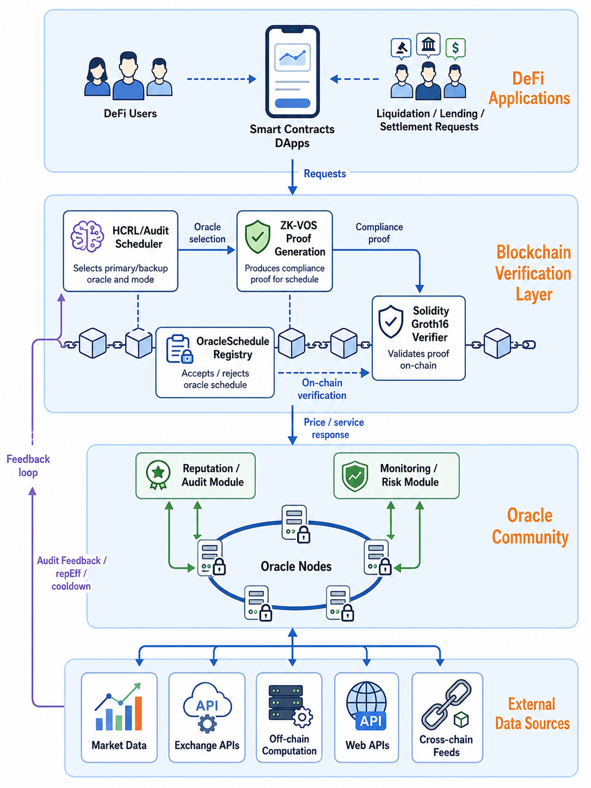

<strong>Figure 1.</strong> Overall framework of ZK-HCRL Oracle.

从系统组成上看，ZK-HCRL Oracle 包含 DeFi 应用层、链上验证与调度层、预言机服务层和外部数据源层。DeFi 应用层产生价格查询、抵押率更新、清算判定和结算触发等业务请求；外部数据源层提供市场数据、交易所接口、Web API、跨链数据源或链下计算结果；预言机服务层由异构预言机节点构成，不同节点在服务类型、处理能力、调用费用、历史验证表现和审计记录方面存在差异。链上验证与调度层是本文框架的核心，其内部包括 ZK-HCRL/Audit Scheduler、OracleSchedule Registry、ZK-VOS Proof Generation 和 Solidity Groth16 Verifier，分别用于生成调度决策、登记调度结果、构造零知识合规证明并完成链上验证。

当 DeFi 预言机服务请求到达时，ZK-HCRL/Audit Scheduler 首先构造审计感知状态表示。该状态融合请求类型、任务长度、到达时间和截止时间等请求级特征，以及候选预言机的等待时间、服务类型匹配关系、调用成本、处理能力、历史验证成功率、有效信誉、审计后验可信度、冷却状态和风险监测指标。随后，层次化约束强化学习策略依次完成执行模式选择、主预言机选择和备份预言机选择。执行模式用于决定当前请求采用成本优先单节点执行、可信优先单节点执行、串行备份恢复、并行快速响应或并行安全冗余；主预言机负责主要服务响应，备份预言机则在高风险或高时延敏感场景中提供恢复或冗余验证能力。该结构使系统能够在低风险请求中降低冗余成本，在高风险请求中增强服务可靠性。

审计反馈机制为调度过程提供持续的信任校正能力。每次服务执行后，系统会收集响应延迟、验证结果、服务类型匹配情况、异常行为记录、审计结果和失败严重度等反馈信息。Reputation/Audit Module 基于上述反馈更新预言机的审计后验和有效信誉，Monitoring/Risk Module 则持续估计节点负载、异常行为和风险趋势。更新后的审计信息进一步参与后续状态编码、动作掩码和奖励计算，使调度策略能够逐步降低伪装型恶意节点、疲劳节点和高风险节点的被选概率，从而形成“调度—执行—审计反馈—再调度”的闭环优化机制。

零知识合规证明机制用于解决智能调度结果的链上可验证问题。由于 ZK-HCRL 调度器的内部状态包含节点风险评分、审计证据、历史行为记录和策略输出等敏感信息，直接公开这些信息可能泄露防御策略并被恶意节点利用。因此，ZK-VOS 不要求链上合约复现完整的强化学习推理过程，而是围绕调度结果的合规性构造可验证命题，包括候选节点合法性、服务类型兼容性、成本预算满足性、延迟约束满足性、风险预算满足性和审计更新正确性。调度器以内部风险评分和审计证据作为私有 witness 生成零知识证明，链上合约仅验证证明是否成立，即可确认调度结果满足 DeFi 服务约束，而无需获知内部策略细节。

形式化地，对于时刻 $t$ 到达的 DeFi 预言机服务请求，ZK-HCRL Oracle 输出的调度动作定义为

$$
a_t^{ZK\text{-}HCRL}=(m_t,p_t,b_t,\pi_t^{zk}),
$$

其中 $m_t$ 表示执行模式，$p_t$ 表示主预言机，$b_t$ 表示备份预言机，$\pi_t^{zk}$ 表示与当前调度结果绑定的零知识合规证明。该定义表明，本文方法的输出并非单一预言机节点，而是同时包含服务编排、风险冗余和可验证合规性的复合调度结果。基于上述设计，ZK-HCRL Oracle 将层次化约束强化学习、审计反馈驱动的信任管理和零知识合规证明统一到同一框架中，为 DeFi 场景下的可验证预言机服务调度提供了系统化建模基础。
## 4.2 Problem Formulation

本文研究 DeFi 场景下的可验证预言机服务调度问题。设系统在调度周期内接收连续到达的服务请求序列：

$$
\mathcal{R}=\{r_1,r_2,\ldots,r_T\},
$$

其中 $T$ 表示请求总数。每个请求 $r_t$ 定义为：

$$
r_t=(\tau_t,A_t,L_t,D_t,\omega_t),
$$

其中 $\tau_t$ 表示请求服务类型，$A_t$ 表示到达时间，$L_t$ 表示任务规模或数据处理长度，$D_t$ 表示截止时间，$\omega_t$ 表示请求重要性或风险权重。在 DeFi 应用中，不同请求具有不同的经济敏感性。例如，普通价格查询、抵押率更新、清算触发和大额结算对时延、可信度和风险控制的要求并不相同。因此，预言机调度不仅需要返回可用结果，还需要兼顾服务质量、节点可信性、调用成本和链上可验证性。

设候选预言机集合为：

$$
\mathcal{O}=\{o_1,o_2,\ldots,o_N\},
$$

其中 $N$ 为候选节点数量。每个预言机 $o_i$ 由静态服务属性和动态信任状态共同描述：

$$
o_i=(\tau_i,c_i,acc_i,q_i,p_i^{val},p_i^{beh},rep_i,load_i,\alpha_i,\beta_i),
$$

其中 $\tau_i$ 表示节点支持的服务类型，$c_i$ 表示调用成本，$acc_i$ 表示处理能力，$q_i$ 表示质押代币或经济担保水平，$p_i^{val}$ 表示验证成功概率，$p_i^{beh}$ 表示行为风险分布，$rep_i$ 表示历史信誉，$load_i$ 表示当前或近期负载，$\alpha_i$ 和 $\beta_i$ 分别表示审计通过与审计失败所累积的后验证据。这些变量共同决定节点在当前请求下的可用性、可靠性和风险水平。

对于请求 $r_t$，ZK-HCRL Oracle 输出的不是单一预言机索引，而是一个复合调度动作：

$$
a_t=(m_t,p_t,b_t,\pi_t^{zk}),
$$

其中 $m_t$ 表示执行模式，$p_t$ 表示主预言机，$b_t$ 表示备份预言机，$\pi_t^{zk}$ 表示与该次调度绑定的零知识合规证明。执行模式从集合 $\mathcal{M}$ 中选择：

$$
m_t\in\mathcal{M}=\{single\_cost,single\_safe,serial\_safe,parallel\_fast,parallel\_safe\}.
$$

主备节点满足：

$$
p_t\in\mathcal{O},\quad b_t\in\mathcal{O}\cup\{-1\}.
$$

其中 $b_t=-1$ 表示当前模式不启用备份；若执行模式需要备份，则要求 $b_t\neq p_t$，以保证主备冗余的有效性。不同模式对应不同的服务编排方式：单节点模式主要降低调用成本，串行备份模式强调失败恢复，并行模式则通过冗余执行提高实时性和安全性。

给定状态 $s_t$ 和动作 $a_t$ 后，系统产生服务结果和反馈信息。记 $Y_t\in\{0,1\}$ 表示请求是否成功完成，$C_t$ 表示总调用成本，$T_t$ 表示最终响应时间，$\rho_t$ 表示调度风险，$R_t$ 表示即时奖励。其中 $C_t$ 与所选预言机数量、节点调用费用和执行模式有关；$T_t$ 由节点等待时间、执行时间和主备执行语义共同决定；$\rho_t$ 则由节点信誉、审计后验、近期失败率、行为风险和冷却状态等因素估计。由此，预言机调度被建模为一个同时受服务质量、经济成本和安全风险约束的序列决策问题。

本文将该问题形式化为带约束的层次化马尔可夫决策过程。系统状态 $s_t$ 包括请求级特征、候选预言机状态、审计后验和近期风险统计；动作 $a_t$ 由执行模式策略、主预言机策略和备份预言机策略联合生成；奖励函数 $R_t$ 综合刻画服务成功、验证结果、类型匹配、信誉水平、响应延迟、调用成本、行为风险和审计风险。调度策略 $\pi$ 的目标是在长期请求序列中最大化期望累计折扣收益：

$$
\max_{\pi}\;J(\pi)=
\mathbb{E}_{\pi}\left[
\sum_{t=1}^{T}\gamma^{t-1}R_t
\right],
$$

其中 $\gamma\in(0,1]$ 为折扣因子，$\pi$ 表示由 $\pi_m$、$\pi_p$ 和 $\pi_b$ 组成的层次化调度策略。

同时，DeFi 预言机服务需要满足成本、延迟和风险约束：

$$
\mathbb{E}_{\pi}[C_t]\leq B_c,
$$

$$
\mathbb{E}_{\pi}[T_t]\leq B_l,
$$

$$
\mathbb{E}_{\pi}[\rho_t]\leq B_r,
$$

其中 $B_c$、$B_l$ 和 $B_r$ 分别表示成本预算、延迟预算和风险预算。成本约束用于避免过度调用高费用节点或不必要的并行冗余；延迟约束保证服务响应满足 DeFi 业务的实时性要求；风险约束限制低信誉、高异常概率或审计失败节点的使用频率。对于经济敏感性更高的请求，可通过提高 $\omega_t$ 或收紧风险预算 $B_r$ 强化安全要求。

除上述优化约束外，本文进一步引入链上合规验证条件。设 $\mathcal{C}_{zk}$ 表示 ZK-VOS 需要证明的调度合规命题集合，包括节点选择合法性、服务类型兼容性、成本预算满足性、延迟约束满足性、风险预算满足性和审计更新正确性。调度器根据私有 witness 生成零知识证明 $\pi_t^{zk}$，链上合约验证：

$$
Verify(C_t^{pub},\pi_t^{zk})=1,
$$

其中 $C_t^{pub}$ 表示公开输入或承诺。该条件保证链上合约能够确认调度结果满足预定义规则，而无需获取内部风险评分、审计证据、历史行为记录或策略网络输出。

综上，本文的目标是在连续到达的 DeFi 预言机服务请求下，学习一个层次化调度策略 $\pi$，使其在满足成本、延迟、风险和零知识合规验证约束的同时，最大化长期服务收益。该问题的核心挑战在于：预言机节点具有异构能力和动态信任状态，请求具有不同的实时性与经济风险，而调度结果还必须在保护内部策略隐私的前提下接受链上验证。

## 4.3 Audit-aware State Representation

在上述问题定义基础上，ZK-HCRL Oracle 将调度状态构造为请求上下文、候选预言机属性和审计反馈状态的联合表示。对于当前到达的 DeFi 请求 $r_t$，请求级特征定义为

$$
x_t^{req}=
\left[
\frac{\tau_t}{\tau_{\max}},
\frac{L_t}{\bar{L}},
\frac{D_t-A_t}{D_{\max}},
\omega_t
\right],
$$

其中 $\tau_t$ 表示请求服务类型，$L_t$ 表示任务规模，$D_t-A_t$ 表示可用响应窗口，$\omega_t$ 表示请求的重要性或经济风险权重。该表示刻画了不同 DeFi 服务在类型匹配、响应时限和安全等级方面的差异。例如，普通价格查询更关注成本与响应速度，而清算触发和大额结算更强调可信度、验证成功率和风险约束。

对于候选预言机 $o_i$，本文构造审计感知节点特征：

$$
x_{t,i}^{oracle}=
[
wait_i,\,
rep_i^{eff},\,
c_i,\,
acc_i,\,
match_i,\,
val_i,\,
load_i,\,
risk_i^{beh},\,
q_i,\,
truth_i,\,
fail_i^{audit},\,
cooldown_i
],
$$

其中 $wait_i$ 表示当前排队等待时间，$rep_i^{eff}$ 表示审计修正后的有效信誉，$c_i$ 和 $acc_i$ 分别表示调用成本与处理能力，$match_i$ 表示节点服务类型是否匹配当前请求，$val_i$ 表示验证成功估计，$load_i$ 表示近期负载，$risk_i^{beh}$ 表示由行为异常和响应延迟共同形成的风险特征，$q_i$ 表示质押或经济担保水平，$truth_i$ 表示审计后验可信度，$fail_i^{audit}$ 表示审计失败水平，$cooldown_i$ 表示审计失败后的冷却状态。与仅使用历史成功率的状态不同，该表示同时编码了节点性能、经济成本、服务兼容性、审计后验和近期风险，使调度器能够识别短期表现良好但存在隐藏风险的节点。

有效信誉由历史信誉和审计后验共同决定：

$$
rep_i^{eff}=clip((1-w_a)rep_i+w_a truth_i-\eta cooldown_i,0,1),
$$

其中 $w_a$ 为审计后验权重，$\eta$ 为冷却惩罚系数。该变量直接参与状态编码、动作筛选和奖励计算，从而使审计失败、冷却惩罚和风险暴露能够及时反馈到后续调度中。基于上述节点特征，主预言机策略与备份预言机策略的基础状态表示为

$$
s_t^p=[x_t^{req},x_{t,1}^{oracle},\ldots,x_{t,N}^{oracle}].
$$

该状态提供了单个候选节点的局部属性，但尚未显式建模候选预言机之间的关系。因此，本文进一步引入关系感知 oracle 图编码器，以获得更具上下文信息的候选节点表示。

## 4.4 Relation-aware Oracle Graph Encoder

在 DeFi 预言机服务中，候选节点并非相互独立。同一服务类型的节点可能面临相似负载，低成本节点可能具有更高验证失败风险，信誉接近的节点在长期调度中也可能形成相似的服务表现。若调度策略仅基于独立节点特征进行选择，则难以感知候选池整体结构，尤其难以判断当前是否存在足够可靠的备份节点。为此，本文设计轻量级关系感知 oracle 图编码器，将候选预言机池建模为动态图

$$
G_t=(\mathcal{O},E_t),
$$

其中节点为候选预言机，边表示节点之间的服务相似性、可靠性相似性、负载相似性和成本相似性。为便于说明，Figure 2 给出了关系感知 oracle 图编码器的整体结构。该模块首先根据候选预言机的属性动态构建关系图，然后通过轻量级消息传递获得关系感知节点表示，最后分别为主节点选择策略和执行模式策略提供状态输入。

  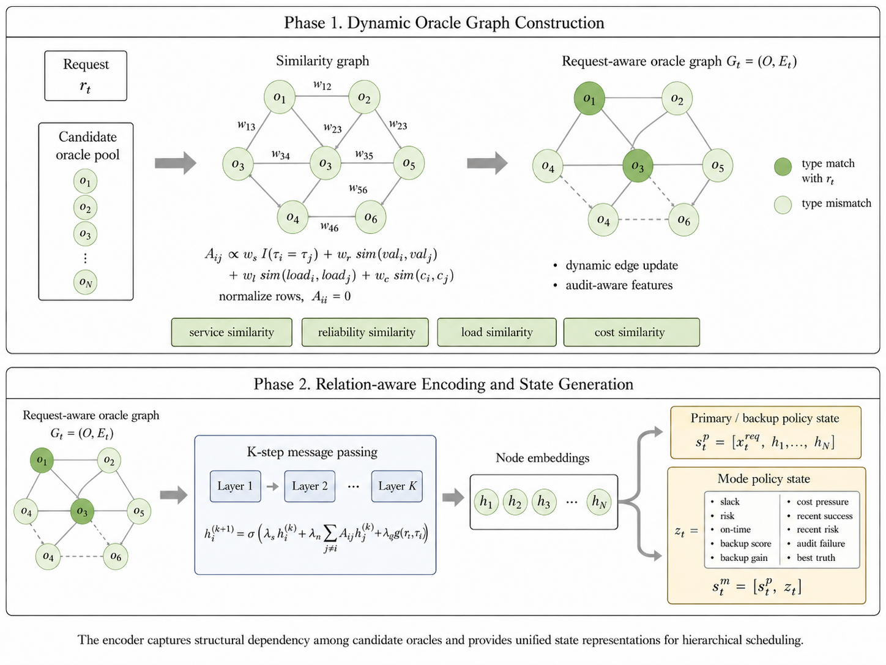

<strong>Figure 2.</strong> Overall architecture of the relation-aware oracle graph encoder.

给定节点特征 $x_{t,i}^{oracle}$，图编码器首先构造归一化邻接权重：

$$
A_{ij}=
\frac{
w_s\mathbb{I}(\tau_i=\tau_j)
+w_r(1-|val_i-val_j|)
+w_l(1-|load_i-load_j|)
+w_c(1-|c_i-c_j|)
}{
\sum_{k\neq i}
\left[
w_s\mathbb{I}(\tau_i=\tau_k)
+w_r(1-|val_i-val_k|)
+w_l(1-|load_i-load_k|)
+w_c(1-|c_i-c_k|)
\right]
+\epsilon
},
\quad i\neq j,
$$

并令 $A_{ii}=0$。其中 $w_s$、$w_r$、$w_l$ 和 $w_c$ 分别控制服务类型、可靠性、负载和成本相似性的权重，$\epsilon$ 为避免除零的平滑项。该邻接构造不依赖固定拓扑，而是随请求到达、节点负载、信誉变化和审计反馈动态更新，因此能够反映当前候选池的即时结构。

随后，图编码器执行多步邻域聚合。初始节点状态设为

$$
h_i^{(0)}=x_{t,i}^{oracle}.
$$

第 $k$ 步更新定义为

$$
h_i^{(k+1)}=\sigma\!\left(\lambda_s h_i^{(k)}+\lambda_n \sum_{j\ne i} A_{ij}h_j^{(k)}+\lambda_q g(\tau_t,\tau_i)\right).
$$

其中 $\lambda_s$ 和 $\lambda_n$ 分别表示自环信息与邻域信息权重，$g(\tau_t,\tau_i)$ 为请求类型门控项，用于增强与当前请求服务类型匹配的节点表示，$\sigma(\cdot)$ 为非线性映射。经过 $K$ 步消息传递后，得到关系感知节点表示 $h_i=h_i^{(K)}$。在实现中，该编码器采用少量消息传递步数，以避免引入过高计算开销，同时保留候选池中最重要的结构关系。

编码后的节点表示被用于构造策略输入：

$$
s_t^p=[x_t^{req},h_1,\ldots,h_N].
$$

对于执行模式策略，系统进一步构造全局摘要向量：

$$
z_t=[
slack_t,\,
risk_t^p,\,
ontime_t^p,\,
score_t^b,\,
gain_t^b,\,
pressure_t^c,\,
succ_t^{recent},\,
risk_t^{recent},\,
fail_t^{audit},\,
truth_t^{best}
],
$$

其中 $slack_t$ 表示截止时间余量，$risk_t^p$ 与 $ontime_t^p$ 表示候选主节点的风险和准时响应估计，$score_t^b$ 与 $gain_t^b$ 表示最优备份评分及其边际收益，$pressure_t^c$ 表示主备组合的成本压力，$succ_t^{recent}$、$risk_t^{recent}$ 和 $fail_t^{audit}$ 表示近期调度与审计统计，$truth_t^{best}$ 表示候选备份节点中的最高审计可信度。因此，执行模式策略的输入为

$$
s_t^m=[s_t^p,z_t].
$$

通过该图编码结构，ZK-HCRL Oracle 不仅能够评估单个预言机的局部可用性，还能够感知候选池中可替代节点、可靠备份节点和潜在风险聚集情况。该设计为后续主节点选择、备份节点选择和执行模式选择提供了统一的关系感知状态基础。
## 4.5 Hierarchical Constrained Scheduling Policy

ZK-HCRL Oracle 采用层次化策略将调度动作分解为执行模式选择、主预言机选择和备份预言机选择。三个策略分别表示为

$$
\pi_m(m_t|s_t^m),\quad
\pi_p(p_t|s_t^p),\quad
\pi_b(b_t|s_t^p,p_t,m_t).
$$

其中 $\pi_m$ 控制服务编排方式，$\pi_p$ 选择主要响应节点，$\pi_b$ 在需要冗余时选择恢复或并行验证节点。该分解降低了复合动作空间的搜索难度，并使策略能够根据请求风险、截止时间、成本压力和候选备份质量自适应调整冗余强度。

执行模式集合 $\mathcal{M}$ 包含五类模式：

$$
\mathcal{M}=
\{single\_cost,\;single\_safe,\;serial\_safe,\;parallel\_fast,\;parallel\_safe\}.
$$

其中，$single\_cost$ 适用于成本敏感且风险较低的请求，$single\_safe$ 倾向选择高信誉节点完成单节点服务，$serial\_safe$ 在主节点失败后调用备份节点以获得恢复能力，$parallel\_fast$ 通过并行执行降低响应时间，$parallel\_safe$ 则用于高风险场景中的冗余验证。与固定单节点或固定并行策略不同，层次化模式策略能够根据当前请求和候选池状态动态决定是否启用备份。

为避免无效探索，调度过程中引入动作掩码。主节点动作掩码首先过滤服务类型不匹配的节点；备份节点动作掩码进一步排除与主节点相同的节点，并要求备份节点满足基本可用性条件。对于执行模式，若不存在合格备份、成本压力过高、截止时间不足或候选主节点风险超过阈值，则相应冗余模式会被禁用：

$$
\pi_m(m|s_t^m)=0,\quad \forall m\notin \mathcal{M}_{valid}(s_t).
$$

该机制将服务类型、主备互斥、成本预算、延迟约束和风险门控显式注入策略空间，使模型在训练早期即可避免大量不合规动作。

调度执行后，系统根据服务结果计算约束奖励。即时奖励由服务成功、验证通过、类型匹配和可信节点选择等正向项，以及成本、延迟、行为风险和审计风险等惩罚项组成：

$$
R_t=w_sY_t+w_vV_t+w_mM_t+w_qQ_t
-\left(w_cC_t+w_lT_t+w_r\rho_t+w_aA_t^{risk}\right),
$$

其中 $Y_t$ 表示服务是否成功，$V_t$ 表示验证结果，$M_t$ 表示服务类型匹配，$Q_t$ 表示有效信誉收益，$C_t$、$T_t$、$\rho_t$ 和 $A_t^{risk}$ 分别表示调用成本、响应时间、综合风险和审计风险。为处理长期预算限制，本文进一步引入约束惩罚：

$$
\tilde{R}_t
=
R_t
-\lambda_c[C_t-B_c]_+
-\lambda_l[T_t-B_l]_+
-\lambda_r[\rho_t-B_r]_+,
$$

其中 $[x]_+=\max(0,x)$，$\lambda_c$、$\lambda_l$ 和 $\lambda_r$ 分别表示成本、延迟和风险约束的拉格朗日惩罚权重。策略更新以 $\tilde{R}_t$ 为学习信号，从而在最大化长期收益的同时抑制预算、延迟和风险越界。

  

<strong>Algorithm 1.</strong> ZK-HCRL Oracle Scheduling.

## 4.6 Evaluation of Hierarchical Scheduling

本节评估 ZK-HCRL 调度策略在 DeFi 预言机服务中的综合性能，主要考察服务成功率、时效性、单位成功成本、恶意节点规避和可信节点覆盖等指标。实验数据由本文基于 Chainlink 价格预言机和交易所价格快照采集构建，覆盖 2026 年 4 月 1 日至 2026 年 4 月 30 日的 DeFi 价格请求场景。数据集包含 BTC/USD、ETH/USD 和 LINK/USD 三类资产对，并以 10 分钟为间隔采集价格观测值。经过缺失值过滤、异常时间戳清理和无效记录剔除后，每个资产对保留 4307 条有效样本，共计 12921 条价格请求样本。

该数据集用于模拟 DeFi 合约中的周期性价格查询请求。每个请求包含资产类型、价格观测值、价格偏差、数据陈旧度、验证状态及相应服务约束。调度器需要根据节点信誉、响应延迟、服务成本、当前负载和审计风险，在候选预言机池中选择主预言机和备份预言机。数据集统计结果如 Table 1 所示。

**Table 1. Dataset statistics of Chainlink-based DeFi oracle price samples.**

| Asset | Samples | Mean Deviation | P95 Deviation | Mean Staleness | Validation Success Rate |
|---|---:|---:|---:|---:|---:|
| BTC/USD | 4307 | 0.1400% | 0.3746% | 1641.76 s | 20.66% |
| ETH/USD | 4307 | 0.1565% | 0.4064% | 1571.22 s | 23.13% |
| LINK/USD | 4307 | 0.1672% | 0.4260% | 1531.62 s | 23.96% |

由 Table 1 可见，三类资产对的平均价格偏差均低于 0.17%，P95 偏差均低于 0.43%，说明价格观测值整体偏离较低。然而，各资产对的平均数据陈旧度均超过 1500 s，验证成功率仅为 20.66%–23.96%，反映出 DeFi 预言机服务中常见的数据时效性不足和验证不确定性问题。因此，该数据集能够为调度策略在异构资产请求和动态服务约束下的评估提供有效实验基础。

比较方法包括基于规则的 Reputation-Greedy、Cost-Aware-Greedy 和 Risk-Aware-Greedy，以及基于强化学习的 PPO、DQN、RA-DQN、PB-SafeDQN 和 COBRA-Oracle。所有方法均在相同请求流、候选预言机集合和攻击扰动条件下重复运行，并报告均值及标准差。评价指标包括服务成功率、准时完成率、平均响应时间、单位成功成本、恶意节点分配率和可信节点覆盖率；其中可信节点覆盖率表示被调度节点中可信节点所占比例。综合调度性能如 Table 2 所示。

**Table 2. Scheduling performance comparison under DeFi oracle service requests.**

| Method | Success Rate | On-time Rate | Avg. Response | Cost/Success | Malicious Rate | Trusted Coverage |
|---|---:|---:|---:|---:|---:|---:|
| Reputation-Greedy | 36.05 ± 1.40% | 90.41 ± 1.53% | 5.62 ± 0.08 | 1.86 ± 0.06 | 8.94 ± 1.79% | 80.89 ± 3.47% |
| Cost-Aware-Greedy | 19.71 ± 0.56% | 100.00 ± 0.00% | 4.82 ± 0.00 | 0.95 ± 0.02 | 45.81 ± 3.15% | 54.17 ± 3.14% |
| Risk-Aware-Greedy | 37.35 ± 0.71% | 85.45 ± 0.97% | 5.85 ± 0.06 | 1.81 ± 0.08 | 8.08 ± 1.25% | 82.58 ± 3.17% |
| PPO | 70.20 ± 1.20% | 97.00 ± 0.17% | 5.32 ± 0.01 | 1.13 ± 0.01 | 3.64 ± 0.78% | 92.69 ± 1.27% |
| DQN | 60.73 ± 2.46% | 91.91 ± 1.04% | 5.51 ± 0.05 | 1.35 ± 0.04 | 3.22 ± 0.36% | 92.68 ± 1.05% |
| RA-DQN | 59.06 ± 2.83% | 91.64 ± 1.48% | 5.51 ± 0.07 | 1.39 ± 0.05 | 3.07 ± 0.18% | 93.01 ± 0.94% |
| PB-SafeDQN | 52.23 ± 3.18% | 89.39 ± 1.07% | 5.53 ± 0.06 | 1.92 ± 0.06 | 7.32 ± 2.06% | 92.79 ± 1.59% |
| COBRA-Oracle | 56.20 ± 2.64% | 88.19 ± 1.11% | 5.65 ± 0.05 | 2.04 ± 0.06 | 10.37 ± 4.85% | 91.87 ± 0.87% |
| **ZK-HCRL Oracle** | **73.41 ± 0.85%** | **96.77 ± 0.23%** | **5.30 ± 0.02** | **1.55 ± 0.04** | **1.12 ± 0.74%** | **95.27 ± 0.32%** |

如 Table 2 所示，ZK-HCRL Oracle 在服务成功率和可信节点覆盖率上取得最优结果，分别达到 73.41% 和 95.27%，同时将恶意节点分配率降至 1.12%。与 PPO、DQN 和 RA-DQN 等单层强化学习方法相比，ZK-HCRL Oracle 通过执行模式、主预言机和备份预言机的分层决策提升了调度成功率，并保持了较高的准时完成率。与 PB-SafeDQN 和 COBRA-Oracle 等主备调度方法相比，ZK-HCRL Oracle 的恶意节点规避能力更强，表明审计感知状态和层次化动作空间有助于识别并规避高风险节点。

规则方法的结果进一步表明，单一目标优化难以满足 DeFi 预言机服务的综合需求。Cost-Aware-Greedy 虽然取得最低的平均响应时间和单位成功成本，但其成功率仅为 19.71%，恶意节点分配率高达 45.81%，可信节点覆盖率也仅为 54.17%，说明单纯追求低成本会显著牺牲可靠性和安全性。Reputation-Greedy 和 Risk-Aware-Greedy 在风险控制方面有所改善，但成功率仍低于 40%，表明静态排序策略难以适应动态请求流、负载变化和攻击扰动。

总体来看，ZK-HCRL Oracle 在成功率、时效性、恶意节点规避和可信覆盖之间取得了更均衡的性能。虽然其单位成功成本高于 Cost-Aware-Greedy、PPO、DQN 和 RA-DQN，但该成本增加换来了更高的服务成功率和更低的恶意节点分配率。对于价格查询、清算触发和资金结算等高价值 DeFi 场景，调度安全性和服务可信性通常比单纯降低成本更关键。因此，实验结果表明，所提出的层次化约束调度机制能够有效提升 DeFi 预言机服务的可靠性与鲁棒性。

# 5. Audit-feedback Trust Management

## 5.1 Threat Model and Audit Signals

DeFi 预言机网络中的节点并非始终保持稳定可信。除能够持续提供类型匹配、及时且可验证数据的可信节点外，系统还可能面临低质量节点、疲劳节点和恶意节点。低质量节点通常表现为响应延迟较高、验证失败率较高或调用成本异常；疲劳节点在连续高负载下出现性能衰减；恶意节点则可能通过信誉投毒、休眠攻击、合谋转移、突发攻击、间歇规避和渐进漂移等方式隐藏真实风险。由于 DeFi 请求通常关联资产价格、清算条件和资金结算，预言机异常行为可能直接导致错误定价、错误清算或资金损失。

为刻画上述动态风险，本文将审计信号统一建模为服务结果信号、行为异常信号和历史趋势信号三类。其中，服务结果信号描述单次请求的执行质量，包括是否按时完成、是否通过验证、服务类型是否匹配以及最终响应延迟；行为异常信号用于捕捉潜在攻击行为，包括异常报价、拒绝服务、连续失败和与历史表现不一致的突发变化；历史趋势信号反映节点的持续风险状态，包括近期失败率、审计失败率、负载变化和冷却状态。与传统信誉机制仅依赖历史成功率不同，本文将上述信号作为审计反馈输入，使节点的近期异常行为能够及时影响后验可信度、有效信誉和后续调度约束。

因此，审计反馈在本文框架中并非简单的事后记录，而是与 ZK-HCRL 调度策略耦合的动态信任信号。一方面，它为调度器提供对低质量节点、疲劳节点和伪装型恶意节点的细粒度风险刻画；另一方面，它通过状态编码、动作掩码和奖励惩罚影响后续请求的节点选择，从而形成“服务执行—审计反馈—信任修正—再调度”的闭环信任管理机制。

## 5.2 Audit Posterior and Risk-aware Trust Update

对每个预言机 $o_i$，系统维护审计后验参数 $(\alpha_i,\beta_i)$，其中 $\alpha_i$ 表示审计通过证据，$\beta_i$ 表示审计失败或风险证据。基于该后验，节点的审计可信度定义为

$$
truth_i=\frac{\alpha_i}{\alpha_i+\beta_i}.
$$

与仅依赖历史成功率的信誉值不同，$truth_i$ 能够更直接地反映近期审计证据对节点可信度的影响。为将历史信誉、审计后验和惩罚状态统一到调度状态中，本文定义有效信誉：

$$
rep_i^{eff}=clip((1-w_a)rep_i+w_a truth_i-\eta cooldown_i,0,1),
$$

其中 $rep_i$ 为历史信誉，$w_a$ 为审计后验权重，$\eta$ 为冷却惩罚系数，$cooldown_i$ 表示节点在审计失败后的惩罚状态。有效信誉直接参与状态编码、动作掩码和奖励计算，从而使近期异常节点在后续调度中被自动降权。

审计触发采用风险感知机制。对于节点 $o_i$，审计概率定义为

$$
P(audit_i)=clip(p_{base}+p_{risk}risk_i,0,p_{max}),
$$

其中 $p_{base}$ 保证最低审计覆盖，$p_{risk}$ 控制风险敏感性，$p_{max}$ 限制最大审计频率。综合风险 $risk_i$ 由有效信誉、审计可信度、近期失败、冷却状态和审计陈旧度共同决定：

$$
risk_i=w_1(1-rep_i^{eff})+w_2(1-truth_i)+w_3fail_i^{recent}+w_4cooldown_i+w_5stale_i,
$$

其中 $stale_i$ 表示距离上次审计的时间间隔。该机制避免对所有节点进行高频审计，同时提高长期未审计且近期表现不稳定节点的审计概率。

审计更新遵循非对称原则。若审计通过，则系统缓慢累积可信证据：

$$
\alpha_i\leftarrow \alpha_i+1.
$$

若审计失败，则系统根据失败严重度 $sev_i$ 快速增加风险证据并降低历史信誉：

$$
\beta_i\leftarrow \beta_i+sev_i,\quad
rep_i\leftarrow rep_i-\delta_{fail}sev_i.
$$

当 $sev_i$ 超过阈值时，节点进入冷却状态。该设计体现了安全关键系统中的保守信任原则，即信任建立应缓慢，而失信惩罚应迅速。由此，恶意节点难以通过短期正常行为快速恢复信誉，同时偶发网络波动对可信节点的长期影响也被限制在可控范围内。
## 5.3 Audit-feedback Evaluation

为验证审计反馈机制的有效性，本文在多类动态攻击场景下分析可信节点与恶意节点的有效信誉变化。实验覆盖 reputation poisoning、sleeper attack、collusion shift、burst attack、intermittent evasion 和 gradual drift 六类攻击模式。评价重点不是单次请求是否成功，而是审计反馈能否在攻击阶段快速降低恶意节点信誉，并在恢复阶段保持较慢的信誉回升速度，从而抑制伪装型和机会主义攻击。

  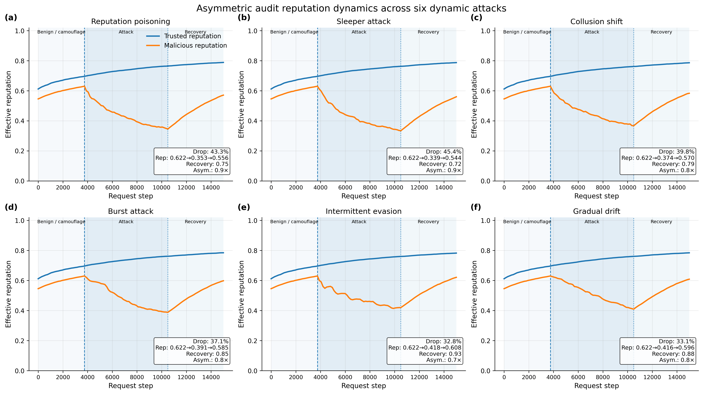

<strong>Figure 3.</strong> Asymmetric audit reputation dynamics under six dynamic attacks.

如 Figure 3 所示，在六类动态攻击下，可信节点信誉保持稳定上升，而恶意节点在攻击阶段均出现明显下降。其中 reputation poisoning 和 sleeper attack 的信誉下降幅度分别达到 43.3% 和 45.4%，collusion shift、burst attack、intermittent evasion 和 gradual drift 也分别产生 39.8%、37.1%、32.8% 和 33.1% 的信誉下降。攻击结束后，恶意节点信誉并未立即恢复至可信节点水平，而是在非对称更新机制作用下缓慢回升。该现象说明审计后验与冷却惩罚能够延长恶意行为的负面影响，降低节点通过短期正常服务快速恢复信誉的可能性。更重要的是，更新后的有效信誉会进一步进入后续请求的状态编码、动作掩码和奖励计算，从而降低恶意节点在后续调度中的被选概率。该结果与第 7.3 节中去除审计反馈后恶意节点选择率显著上升的消融现象相互印证，说明审计反馈不仅改变信誉估计，也实际影响调度决策。

# 6. ZK-VOS Compliance Proof for Verifiable Scheduling

## 6.1 Design Rationale and Verification Scope

ZK-HCRL 调度器在链下执行复杂的状态编码、模式选择和主备预言机决策，能够处理动态负载、节点风险和审计反馈等高维信息。然而，DeFi 合约无法直接信任链下调度结果，尤其在价格查询、清算触发和资金结算等高价值场景中，调度结果必须满足可验证的合规约束。若将调度器的完整内部状态公开到链上，又会暴露节点风险评分、审计证据、策略输出和备份选择逻辑，从而为恶意预言机规避调度策略提供信息。

因此，本文提出 ZK-VOS（Zero-Knowledge Verifiable Oracle Scheduling）机制。其目标不是在链上复现完整的强化学习推理过程，而是在隐藏私有信任信息的前提下，证明给定调度结果满足预定义的服务合规条件。具体而言，ZK-VOS 将链下调度结果映射为一组可验证命题，包括节点选择合法性、服务类型兼容性、冷却状态约束、信誉阈值约束、成本预算、延迟约束和风险预算等。该设计将“智能调度”和“链上验证”解耦，使合约只需验证证明成立，即可接受调度结果。

ZK-VOS 的验证范围聚焦于调度合规性，而非完整神经网络计算。这样做有两个原因：一方面，HCRL 策略网络的前向传播包含大量私有状态与模型输出，直接证明完整推理会显著增加电路规模；另一方面，DeFi 合约真正需要确认的是调度结果是否满足业务安全边界，而不是调度策略的每个中间计算。因此，本文优先验证调度约束和审计相关规则，在保证合规性的同时降低证明成本。

## 6.2 Public Inputs, Private Witnesses, and Compliance Statements

对于时刻 $t$ 的调度动作 $(m_t,p_t,b_t)$，调度器首先生成公开承诺：

$$
C_t^{pub}=Com(r_t,m_t,p_t,b_t,B_c,B_l,B_r,h_t),
$$

其中 $r_t$ 表示 DeFi 请求，$B_c$、$B_l$ 和 $B_r$ 分别表示成本、延迟和风险阈值，$h_t$ 为隐藏状态、审计记录和策略输出的哈希承诺。公开输入仅包含请求承诺、调度承诺、预算阈值、状态哈希和证明本身；私有 witness 则包含节点风险评分、有效信誉、审计证据、冷却状态、候选备份评分、策略输出和审计严重度等敏感信息。

调度器基于私有 witness 生成零知识证明：

$$
\pi_t^{zk}=Prove(w_t,C_t^{pub}),
$$

链上合约执行验证：

$$
Verify(C_t^{pub},\pi_t^{zk})=1.
$$

若验证通过，则说明调度结果满足预定义合规规则，但链上合约无法获知内部风险评分、审计证据或策略输出。在电路实现中，上述公开承诺进一步实例化为选中节点哈希、oracle pool Merkle root、信誉阈值、成本预算、风险预算、截止时间和请求服务类型等公开输入；私有 witness 则包含候选节点属性、Merkle 路径、冷却状态、风险评分和调度约束所需的内部证据。本文将 ZK-VOS 的核心合规命题表示为集合 $\mathcal{C}_{zk}$，其主要内容如下。

| Compliance statement | Verification target |
|---|---|
| Valid schedule | selected primary and backup oracles belong to the candidate set |
| Cooldown constraint | selected oracle is not in a forbidden cooldown state |
| Membership validity | selected oracle index is valid under the current oracle pool |
| Reputation threshold | selected oracle satisfies the minimum effective reputation requirement |
| Cost feasibility | scheduling cost does not exceed the predefined budget |
| Latency feasibility | expected or observed latency satisfies the deadline constraint |
| Risk feasibility | audit-aware risk score remains within the risk budget |
| Service compatibility | selected oracle supports the required service type |

上述命题共同保证调度结果不是任意链下输出，而是满足 DeFi 预言机服务合规边界的可验证服务编排结果。对于需要更高安全保证的应用场景，可进一步扩展电路以覆盖更复杂的审计更新或模式选择逻辑；但在默认设置中，本文优先验证与链上安全直接相关的约束，以避免过高的证明开销。

## 6.3 ZK-VOS Protocol

ZK-VOS 协议由承诺生成、证明生成、链上验证和结果接受四个阶段组成。首先，调度器对请求、调度动作和隐藏状态摘要生成公开承诺；随后根据私有 witness 构造合规证明；链上合约调用 Groth16 验证器检查证明是否成立；若验证通过，OracleScheduleRegistry 接受该调度结果并记录公开状态，否则拒绝该调度。

  

<strong>Algorithm 2.</strong> ZK-VOS Compliance Verification.

## 6.4 Verification Results and On-chain Cost Analysis

为验证 ZK-VOS 对调度合规性的判别能力，本文首先构造合法调度与多类违规调度样本，包括冷却状态违规、成员索引非法、低信誉节点、成本超限、延迟超限、风险超限和服务类型不匹配。每类场景包含 1000 个样本。实验结果表明，ZK-VOS 能够正确接受全部合法调度，并拒绝全部违规调度，所有测试类型的判别准确率均达到 100%。在 witness 检查开销方面，Figure 4(a) 展示了不同合规场景下的时间分布。多数违规样例的检查时间集中在 151--157 ms 区间，而合法调度和成员合法性检查的平均时间约为 210 ms，说明该验证过程能够在较低开销下覆盖多类关键调度约束。

  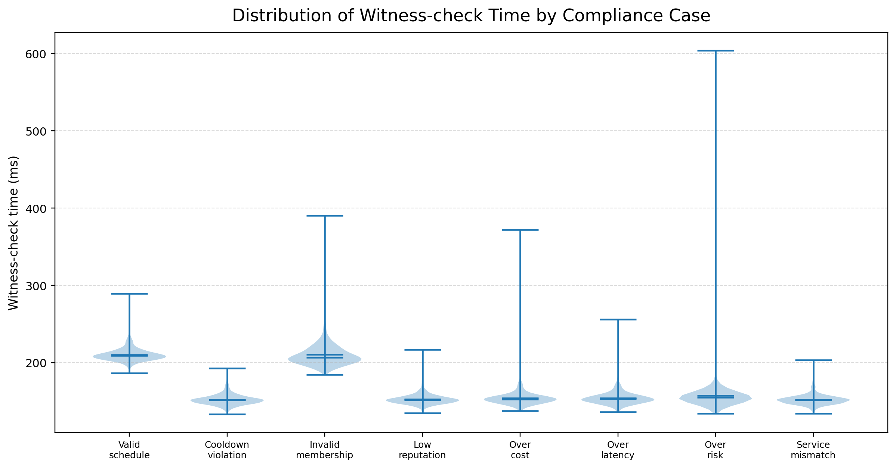

<strong>Figure 4(a).</strong> Distribution of witness-check time across ZK-VOS compliance cases.

进一步地，本文统计完整零知识证明流程的链下时间构成。如 Figure 4(b) 所示，单次证明流程的平均总耗时约为 6920 ms，其中 Groth16 proving 占 50.4%，snarkJS verification 占 45.8%，witness generation 仅占 3.9%。该结果表明，ZK-VOS 的主要链下开销来自证明生成与离线验证，而 witness 构造本身相对轻量。由于这些计算均在链下完成，其开销不会直接增加链上合约执行负担。

  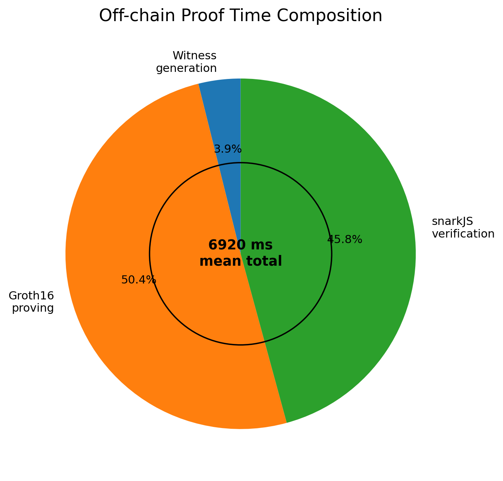

<strong>Figure 4(b).</strong> Off-chain proof time composition of ZK-VOS.

链上 gas 消耗如 Figure 4(c) 所示。Groth16 Verifier 部署消耗 525,594 gas，OracleScheduleRegistry 部署消耗 433,213 gas，真实 Groth16 验证下的 submitSchedule 调用消耗 272,132 gas。其中前两项属于一次性部署成本，而 submitSchedule 表示每次调度合规验证所需的链上开销。结果说明，ZK-VOS 将复杂状态编码、策略推理和证明生成保留在链下执行，链上仅负责固定 Groth16 验证和结果登记，从而在保持可验证合规性的同时提供稳定、可预测的链上验证成本。该 gas 结果用于评估 ZK 验证层自身的链上开销，而不与不提供链上可验证合规性的传统调度 baseline 进行直接 gas 比较。

  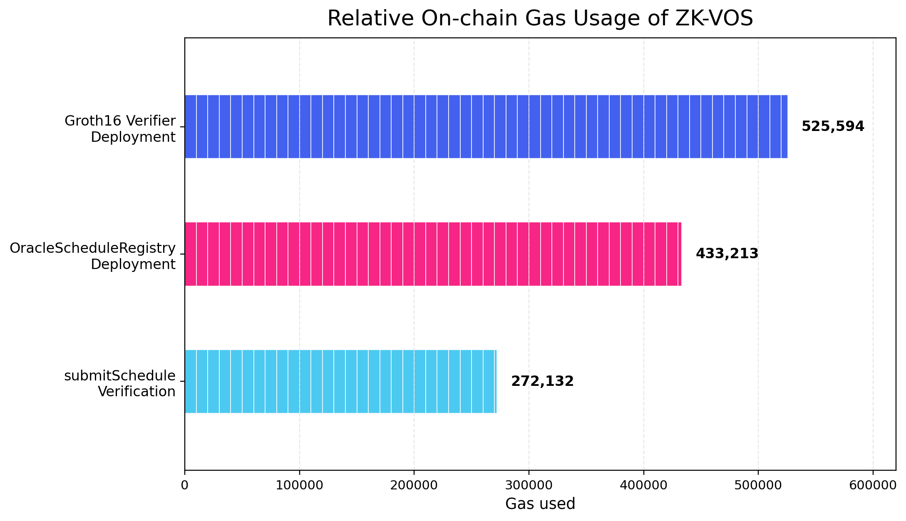

<strong>Figure 4(c).</strong> Relative on-chain gas usage of ZK-VOS.

## 6.5 Scalability Analysis of Batch Scheduling Proofs

除单次合规验证开销外，ZK-VOS 还需要在大规模 DeFi 调度场景中保持稳定的链下证明性能。为进一步评估其扩展性，本文构造不同规模的批量调度任务，并统计调度数量分别为 100、500、1000 和 5000 时的平均证明时间、平均验证时间、证明吞吐率以及总证明耗时。

需要说明的是，Figure 4(b) 统计的是单次端到端证明流程，包含 witness generation、Groth16 proving、snarkJS verification 以及脚本初始化等完整流程开销；而 Figure 4(d) 和 Figure 4(e) 统计的是批量压力测试中的单实例均摊 proof 和 verify 时间。因此，两组结果用于刻画不同实验口径下的开销特征，前者强调完整单次流程，后者强调大规模批量调度下的均摊可扩展性。

如 Figure 4(d) 所示，随着调度数量从 100 增加至 5000，单个调度实例的平均证明时间保持在约 1106--1197 ms 范围内，未随任务规模增加而显著上升。具体而言，当调度数量为 100、500、1000 和 5000 时，平均证明时间分别为 1196.805 ms、1179.098 ms、1109.974 ms 和 1106.278 ms；对应的平均验证时间分别为 807.638 ms、756.566 ms、711.193 ms 和 708.241 ms。该结果表明，在批量调度条件下，ZK-VOS 的单实例证明与验证开销具有较好的稳定性，并未出现明显的规模膨胀现象。

  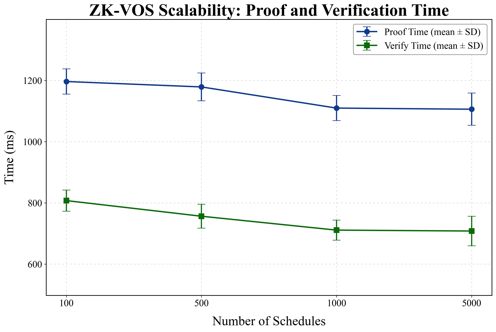

<strong>Figure 4(d).</strong> Scalability of ZK-VOS proof and verification time under different numbers of schedules.

进一步地，Figure 4(e) 展示了证明吞吐率和总证明时间随调度规模变化的趋势。随着调度数量增加，证明吞吐率由约 0.835 proofs/s 提升至约 0.904 proofs/s，并在 1000 个调度样本之后趋于稳定。这说明批量执行能够摊薄部分初始化和运行时开销，使 ZK-VOS 在大规模调度场景下获得更稳定的证明吞吐能力。与此同时，总证明时间随调度数量近似线性增长：当调度数量从 100 增加到 5000 时，总证明时间由约 0.03 h 增加至约 1.54 h。该线性增长趋势说明 ZK-VOS 的批量证明开销主要由调度样本数量驱动，而非由额外的非线性系统瓶颈导致。

  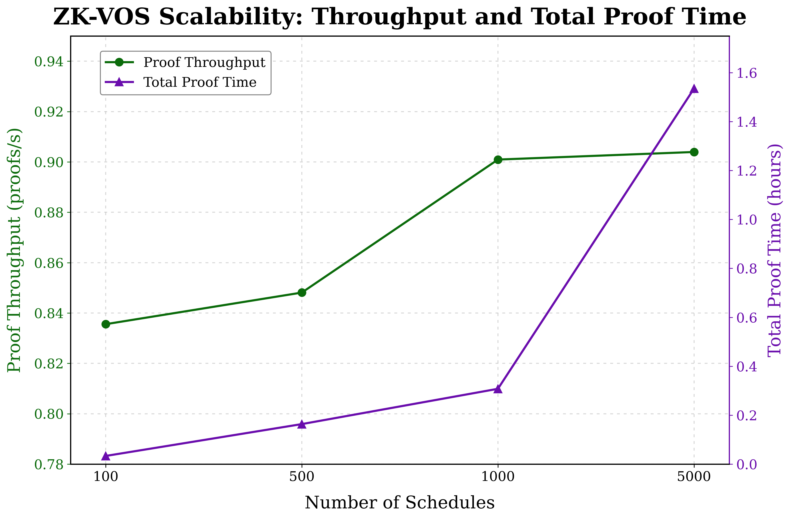

<strong>Figure 4(e).</strong> Proof throughput and total proof time of ZK-VOS under different batch sizes.

总体来看，ZK-VOS 在不同调度规模下表现出稳定的单实例证明时间、逐步提升并趋于饱和的证明吞吐率，以及近似线性的总证明时间增长。这些结果表明，该机制不仅能够为单次 DeFi 预言机调度提供可验证合规保证，也具备扩展到批量调度和高频服务编排场景的潜力。由于证明生成仍然在链下完成，批量规模的增加主要影响链下计算资源消耗，而不会改变链上合约的单次 Groth16 验证逻辑。因此，ZK-VOS 能够在保持链上验证成本稳定的同时，为大规模可验证预言机调度提供可扩展的合规证明支持。

# 7. Integrated Experimental Analysis

## 7.1 Experimental Settings and Stability Analysis

本节进一步给出 ZK-HCRL Oracle 的实现设置与稳定性分析。与第 4.6 节基于 Chainlink-based DeFi request trace 的主调度性能比较不同，本节采用泊松过程生成的合成请求流，用于评估模型在随机初始化、学习率变化、恶意节点比例变化和系统规模扩展下的稳定性与泛化表现。候选预言机具有异构服务类型、调用成本、处理能力、验证成功率和行为风险。比较方法包括 Random、Round-Robin、Earliest、DQN、BLOR、SemiGreedy、PPO、RA-DQN、PB-SafeDQN、COBRA-Oracle 和 ZK-HCRL Oracle。

Table 3 汇总了不同方法在多随机种子下的平均表现。需要注意的是，Table 2 和 Table 3 对应不同实验设置：前者面向真实采集的 DeFi 价格请求轨迹，后者用于检验合成请求流下的训练稳定性。ZK-HCRL Oracle 在成功率、准时成功率和恶意节点规避方面取得较优结果，其成功率达到 77.19%，准时成功率达到 99.13%，恶意节点选择率仅为 0.84%。与 PPO 相比，ZK-HCRL Oracle 的成功率更高，且恶意节点选择率更低；与 DQN、RA-DQN 等单层强化学习方法相比，ZK-HCRL Oracle 在保持较高可信节点覆盖率的同时进一步降低了恶意节点分配风险。

**Table 3. Stability analysis across random seeds.**

| Method | n | Reward ↑ | Success Rate ↑ | Success Time Rate ↑ | Malicious Rate ↓ | Trusted Coverage ↑ | CPS ↓ |
|---|---:|---:|---:|---:|---:|---:|---:|
| Random | 2 | 1507.26 ± 84.63 | 54.83 ± 1.79% | 97.03 ± 0.40% | 20.44 ± 0.51% | 59.93 ± 0.11% | 0.681 ± 0.004 |
| Round-Robin | 2 | 1839.00 ± 66.71 | 59.52 ± 1.25% | 99.93 ± 0.04% | 20.00 ± 0.00% | 60.00 ± 0.00% | 0.794 ± 0.017 |
| Earliest | 2 | 1827.01 ± 44.69 | 59.26 ± 0.72% | 99.88 ± 0.05% | 20.04 ± 0.06% | 59.98 ± 0.00% | 0.797 ± 0.011 |
| DQN | 3 | 2028.80 ± 67.56 | 71.90 ± 1.05% | 94.78 ± 0.21% | 1.74 ± 0.27% | 95.02 ± 0.75% | 1.184 ± 0.008 |
| BLOR | 2 | 1088.90 ± 21.86 | 48.69 ± 0.55% | 94.95 ± 0.68% | 11.20 ± 0.11% | 74.18 ± 1.10% | 1.155 ± 0.021 |
| SemiGreedy | 2 | 316.46 ± 253.41 | 31.60 ± 5.90% | 92.40 ± 0.07% | 7.03 ± 1.49% | 84.32 ± 1.96% | 1.165 ± 0.035 |
| PPO | 2 | **2173.57 ± 23.79** | 73.15 ± 0.04% | 93.73 ± 0.43% | 1.85 ± 0.35% | 93.43 ± 0.53% | **1.039 ± 0.002** |
| RA-DQN | 2 | 2094.38 ± 99.43 | 72.06 ± 1.50% | 94.84 ± 0.59% | 1.78 ± 0.04% | **95.41 ± 1.17%** | 1.181 ± 0.016 |
| PB-SafeDQN | 2 | 1385.08 ± 11.60 | 69.82 ± 0.04% | 92.69 ± 0.51% | 3.46 ± 0.93% | 89.98 ± 0.32% | 1.881 ± 0.040 |
| COBRA-Oracle | 2 | 1317.62 ± 26.28 | 72.33 ± 0.69% | 91.39 ± 0.62% | 3.04 ± 0.90% | 89.85 ± 5.33% | 2.028 ± 0.012 |
| **ZK-HCRL Oracle** | 3 | 1823.41 ± 160.93 | **77.19 ± 0.29%** | **99.13 ± 0.89%** | **0.84 ± 0.16%** | 91.45 ± 4.36% | 1.558 ± 0.099 |

此外，本文评估了不同学习率下 ZK-HCRL Oracle 的训练收敛特性。Figure 5 给出了总奖励、服务成功率和单位成功成本随训练轮次的变化情况。总体来看，各学习率设置均在训练初期快速收敛，并在约 15–25 个 episode 后趋于稳定。较小学习率通常表现出更平滑的收敛轨迹，但早期提升相对较慢；较大学习率虽能加快前期学习，却更易在后期产生波动。综合三项指标可见，ZK-HCRL Oracle 对学习率具有较好的适应性，但仍需在收敛速度、稳定性与成本效率之间进行权衡。

<table align="center">
  <tr>
    <td align="center" width="33%">
      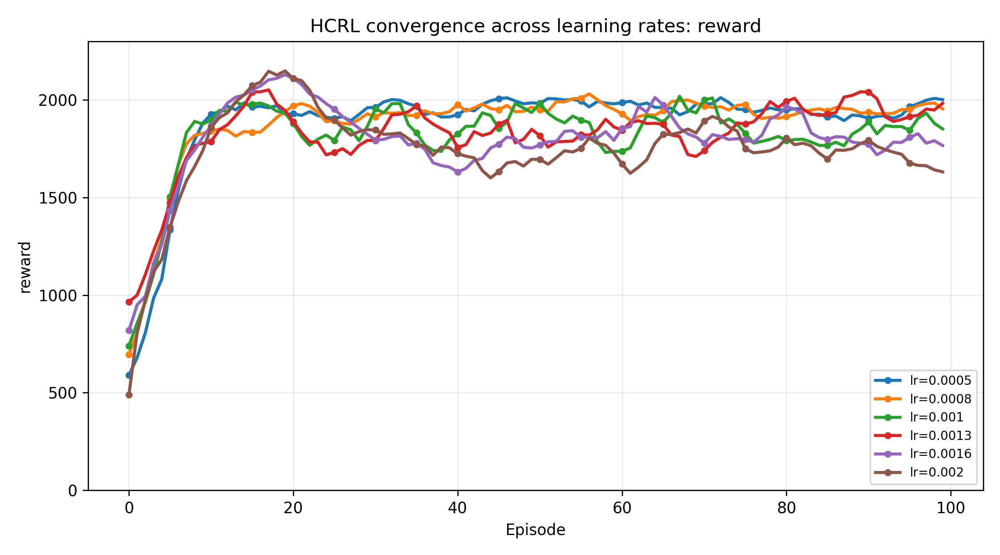 
      <strong>(a)</strong> Reward
    </td>
    <td align="center" width="33%">
      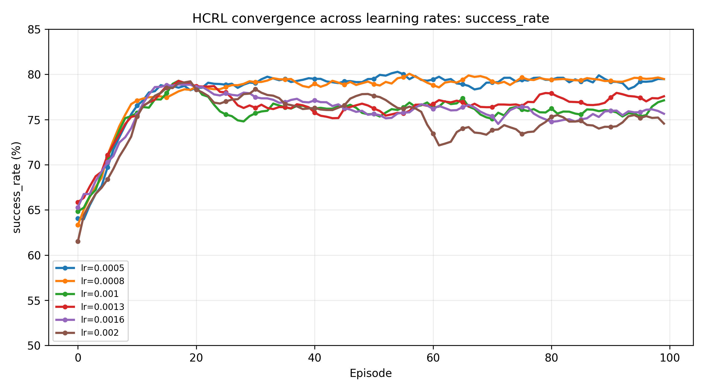 
      <strong>(b)</strong> Success rate
    </td>
    <td align="center" width="33%">
      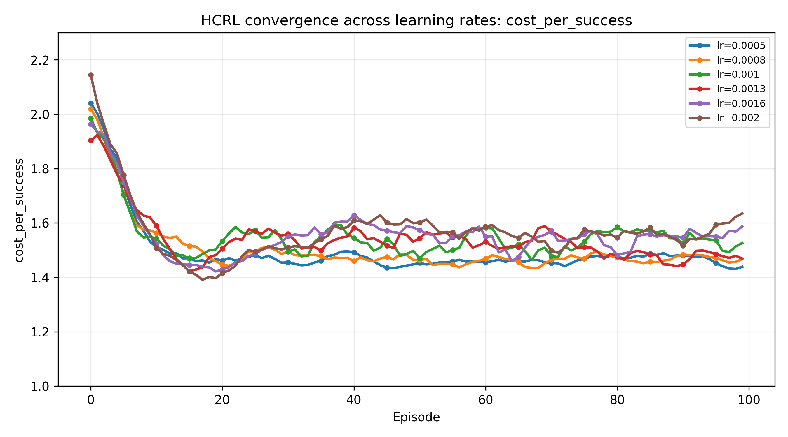 
      <strong>(c)</strong> Cost per success
    </td>
  </tr>
</table>

<strong>Figure 5.</strong> Learning-rate convergence analysis of ZK-HCRL Oracle.

## 7.2 Robustness and Scalability Analysis

为进一步评估 ZK-HCRL Oracle 在复杂环境中的适应能力，本文从恶意节点比例和预言机池规模两个角度开展补充实验。前者用于检验模型在高风险场景下的鲁棒性，后者用于分析模型在更大候选空间中的可扩展性。与标准性能比较不同，本节重点关注模型在风险增强和系统规模变化时的稳定性、风险控制能力和泛化表现。

### (1) Robustness under increasing malicious-node ratios

本文将恶意节点比例从 10% 逐步提高至 50%，观察 ZK-HCRL Oracle 的性能变化。结果显示，随着恶意节点比例升高，服务成功率由 85.99% 下降至 75.18%，说明高风险环境会对任务完成率造成一定影响。然而，即使在 50% 恶意节点场景下，模型的准时成功率仍保持在 98.88% 以上，恶意节点选择率最高仅为 1.73%，可信节点选择率稳定在约 94%–96%。这表明 ZK-HCRL Oracle 在风险增强时虽存在一定性能退化，但仍能维持较强的恶意节点规避和时效性保障能力。

从效率指标看，平均响应时间始终维持在约 5.16–5.18，说明恶意比例升高并未导致明显调度延迟。单位成功成本由 1.507 上升至 1.683，审计失败率由 4.90% 上升至 6.40%，表明系统需要付出更多审计和备份开销来维持可靠性。总体而言，模型呈现出“成功率有限下降、成本适度增加、恶意选择率持续受控”的特征，说明审计感知状态、风险约束和主备调度机制能够共同增强高风险场景下的鲁棒性。

<table align="center">
  <tr>
    <td align="center" width="33%">
      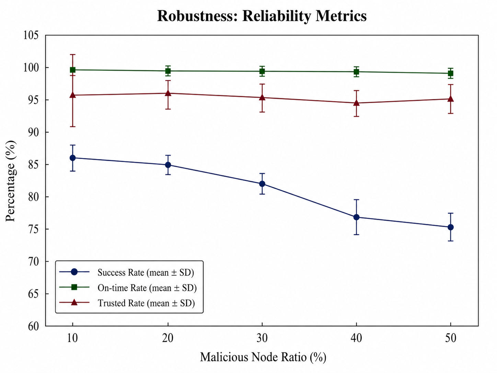 
      <strong>(a)</strong> Reliability metrics
    </td>
    <td align="center" width="33%">
      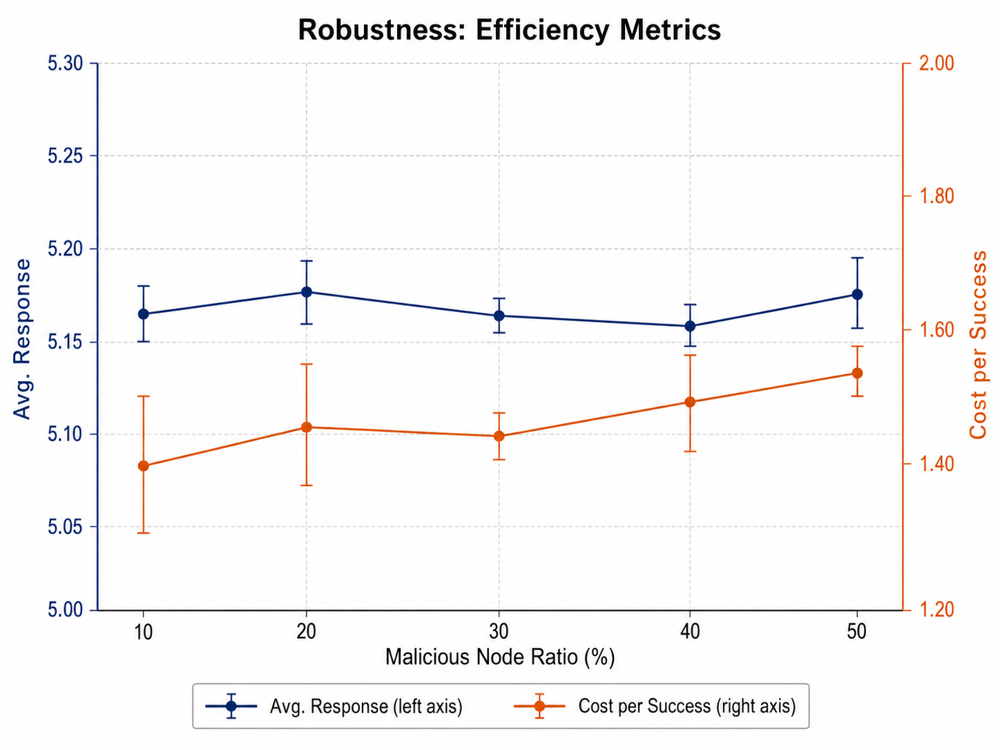 
      <strong>(b)</strong> Efficiency metrics
    </td>
    <td align="center" width="33%">
      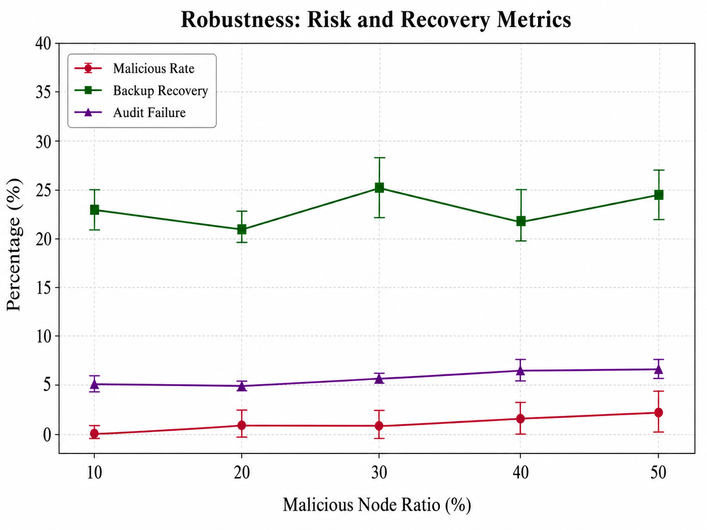 
      <strong>(c)</strong> Risk and recovery metrics
    </td>
  </tr>
</table>

<strong>Figure 6.</strong> Robustness analysis of ZK-HCRL Oracle under different malicious-node ratios.

如 Figure 6 所示，恶意节点比例升高后，成功率逐步下降，但准时成功率始终保持高位；单位成功成本随风险增强而上升，而平均响应时间基本稳定；恶意节点选择率和审计失败率虽有所增加，但整体仍处于较低水平。上述结果表明，ZK-HCRL Oracle 能够在恶意节点比例显著提高时保持较强的风险抑制能力和服务时效性。

### (2) Scalability under different oracle-pool sizes

为验证 ZK-HCRL Oracle 在不同系统规模下的扩展能力，本文在保持调度任务设置一致的基础上，逐步扩大预言机池规模，并从调度效率、调度可靠性以及风险控制与恢复能力三个方面进行评估。

从调度效率来看，随着预言机池规模由 15 扩展至 150，平均响应时间由 5.64 降低至 5.18，说明更大的候选节点集合为调度器提供了更多低延迟节点选择空间。与此同时，单位成功成本始终维持在 1.46--1.58 的较窄范围内，并未随系统规模扩大而明显上升，表明模型在提升响应效率的同时能够保持较稳定的调度成本。

从调度可靠性来看，成功率由 66.8% 提升至 83.9%，准时率由 89.4% 提升至 97.0%，可信节点选择率也由 84.8% 提升至 94.2%。该结果表明，随着候选预言机数量增加，层次化调度策略能够更充分地利用不同节点之间的质量差异，从而在更大的搜索空间中选择更可靠的服务节点。

从风险控制与恢复能力来看，恶意节点选择率在所有规模设置下均低于 1%，说明模型在包含固定比例恶意节点的候选池中仍能有效规避高风险节点。备份恢复率整体保持在 23.77%--28.68% 范围内，审计失败率由 7.84% 下降至约 5.45%，表明审计反馈与备份调度机制在系统规模扩大时仍能维持稳定的风险抑制和故障恢复能力。

<table align="center">
  <tr>
    <td align="center" width="33%">
       
      <strong>(a)</strong> Scheduling efficiency
    </td>
    <td align="center" width="33%">
       
      <strong>(b)</strong> Scheduling reliability
    </td>
    <td align="center" width="33%">
       
      <strong>(c)</strong> Risk control and backup recovery
    </td>
  </tr>
</table>

<strong>Figure 7.</strong> Scalability analysis of ZK-HCRL Oracle under different oracle-pool sizes.

总体来看，在恶意节点、普通节点和可信节点各占三分之一的设置下，ZK-HCRL Oracle 在预言机池规模从 15 扩展至 150 的过程中仍表现出良好的规模适应性。随着候选节点数量增加，模型成功率、准时率和可信节点选择率明显提升，平均响应时间下降，单位成功成本保持稳定，且恶意节点选择率始终低于 1%。这些结果说明，本文提出的审计感知层次化调度机制不仅能够适应小规模预言机服务场景，也具备扩展到更大规模 DeFi 预言机网络的潜力。

## 7.3 Ablation Study and Deployment Overhead

为分析各模块对整体性能的贡献，本文进一步进行消融实验。实验比较完整模型 ZK-HCRL-Full 与去除 GNN 编码器、审计反馈、约束引导、随机备份、固定单节点执行和固定并行执行等变体。完整模型并非在所有单项指标上均最优，而是在成功率、恶意节点规避、可信节点覆盖、恢复能力和单位成功成本之间取得更优综合权衡。完整结果如 Table 4 所示。

**Table 4. Ablation results of ZK-HCRL Oracle.**

| Variant | Reward ↑ | Success ↑ | On-time ↑ | Resp. ↓ | Cost ↓ | CPS ↓ | Malicious ↓ | Trusted ↑ | Recovery ↑ | Single | Serial | Parallel |
|---|---:|---:|---:|---:|---:|---:|---:|---:|---:|---:|---:|---:|
| ZK-HCRL-Full | **2131.76** | 79.38% | 94.38% | 5.376 | 1.092 | 1.376 | 0.59% | **96.08%** | 29.31% | 2.43% | 18.55% | 79.03% |
| w/o GNN | 1992.94 | 69.88% | 96.15% | 5.291 | 1.145 | 1.639 | 1.85% | 87.40% | 23.17% | 2.15% | 34.88% | 62.98% |
| w/o Audit | 1657.39 | 72.00% | 96.47% | 5.257 | 1.272 | 1.767 | 4.05% | 82.70% | **32.93%** | 1.77% | 24.30% | 73.92% |
| w/o Constraint | 1657.39 | 76.88% | 94.38% | 5.376 | 1.282 | 1.668 | 0.83% | 94.08% | 29.31% | 2.43% | 18.55% | 79.03% |
| Random Backup | 1519.82 | 67.83% | **97.10%** | **5.207** | 1.136 | 1.675 | **0.50%** | 93.42% | 18.03% | 2.55% | 30.18% | 67.27% |
| Fixed Single | 1076.54 | 65.58% | 88.28% | 5.631 | **0.837** | **1.276** | 0.78% | 96.33% | 0.00% | 100.00% | 0.00% | 0.00% |
| Fixed Parallel | 1842.93 | 77.55% | 95.85% | 5.293 | 1.279 | 1.649 | 0.65% | 89.48% | 32.10% | 0.00% | 0.00% | 100.00% |

如 Table 4 所示，ZK-HCRL-Full 在总奖励和可信节点选择率上取得最优结果，分别达到 2131.76 和 96.08%，同时保持较低的恶意节点选择率 0.59%。去除 GNN 后，成功率从 79.38% 降至 69.88%，可信节点选择率下降至 87.40%，恶意节点选择率上升至 1.85%，说明图结构表征有助于建模预言机之间的服务关系和风险关联。去除审计反馈后，恶意节点选择率进一步升至 4.05%，可信节点选择率降至 82.70%，表明审计后验对动态风险修正和恶意节点抑制具有关键作用。

约束引导消融中，w/o Constraint 的总奖励下降至 1657.39，单位成功成本升至 1.668，说明成本、风险和可行性约束能够提升长期调度收益和成本效率。由于该变体的执行模式分布与完整模型接近，本文将其解释为去除约束惩罚或约束引导后的消融，而非完全移除动作掩码。

备份相关消融进一步验证了主备机制的必要性。Random Backup 的恢复率仅为 18.03%，明显低于完整模型的 29.31%，说明学习式备份选择器能够提升故障恢复能力。Fixed Single 虽然成本最低，但成功率仅为 65.58%，且恢复率为 0%，难以满足高风险 DeFi 请求的可靠性需求。Fixed Parallel 的恢复率较高，但成本和单位成功成本均高于完整模型，说明无差别并行会带来冗余开销，而自适应模式策略能够在可靠性与成本之间取得更优平衡。

部署方面，ZK-HCRL Oracle 采用链下调度与链上验证的混合架构。高维状态编码、策略推理、审计更新和证明生成在链下完成，链上仅保存承诺、证明和调度接受结果。第 6.4 节结果表明，ZK-VOS 可通过 222 个 template instances、2700 个非线性约束和 3112 个线性约束完成调度合规验证，单次 submitSchedule 的真实 Groth16 验证成本为 272,132 gas。该设计将复杂计算保留在链下，并通过固定的链上验证路径为 DeFi 预言机服务提供可验证合规性。

总体而言，消融实验表明：GNN 编码器和审计反馈提升了可信节点识别与风险抑制能力；学习式备份和主备执行增强了失败恢复能力；自适应模式策略避免了固定单节点可靠性不足和固定并行冗余成本过高的问题。结合 ZK-VOS，本文框架实现了“智能调度—审计反馈—零知识验证”的闭环式可验证预言机服务调度。

# 8. Discussion

> 本章按你的要求暂时“不动”，此处先放占位内容，后续可在英文投稿前统一重写。

本文提出的 ZK-HCRL Oracle 将强化学习调度、审计感知信任管理和零知识可验证机制结合在一起，为区块链预言机选择提供了一种新的系统化思路。与单层预言机选择相比，层次化策略能够更灵活地处理低成本、低延迟和高安全之间的冲突。与固定主备机制相比，HCRL 可以根据请求风险和备份质量决定是否使用备份，从而避免不必要的成本开销。

然而，当前方法仍存在一些需要进一步完善的方面。首先，ZK-VOS 的证明电路设计需要在安全性和效率之间平衡。若验证整个强化学习策略网络，证明成本可能较高；若只验证约束和审计更新，则需要额外假设链下调度器不会偏离策略。其次，仿真环境虽然可以控制恶意节点比例、攻击强度和负载条件，但真实预言机网络中的行为更加复杂。未来工作可以将该框架部署到真实智能合约测试网络中，并引入实际 oracle service traces 进行验证。

---

# 9. Conclusion

> 本章按你的要求暂时“不动”，此处先放占位内容，后续可在英文投稿前统一重写。

本文提出了一种面向区块链预言机选择的 ZK-HCRL Oracle 框架。该框架通过层次化约束强化学习实现执行模式、主预言机和备份预言机的联合决策，通过审计感知声誉机制提高对伪装型恶意节点的识别能力，并通过 ZK-VOS 机制支持隐私保护的链上可验证调度。与传统单预言机选择和固定主备策略相比，ZK-HCRL Oracle 具有更强的动态适应性、安全恢复能力和可审计性。

未来工作将进一步完善零知识证明电路实现，补充真实链上验证开销实验，并在更多攻击场景和真实预言机数据上评估模型泛化能力。

---
